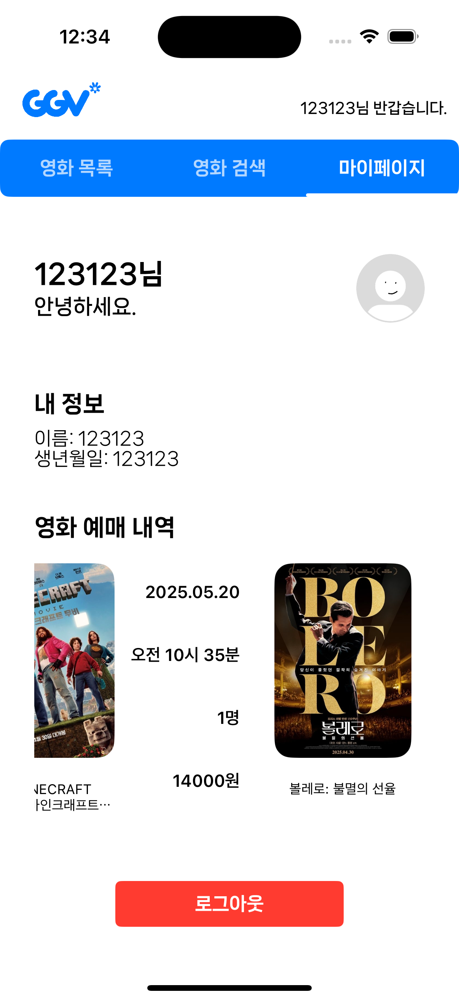

# GGV - 영화 예매 애플리케이션

GGV는 영화 정보를 탐색하고 예매할 수 있는 iOS 애플리케이션입니다. TMDB API를 활용하여 현재 상영 중인 영화, 개봉 예정 영화, 인기 영화 등의 정보를 제공하며, 사용자는 영화를 검색하고 예매할 수 있습니다.


## 주요 기능

- **영화 탐색**: 현재 상영 중인 영화, 개봉 예정 영화, 인기 영화를 탐색할 수 있습니다.
- **영화 검색**: 특정 영화를 검색하고 상세 정보를 확인할 수 있습니다.
- **영화 상세 정보**: 영화의 줄거리, 평점, 출시일 등 상세 정보를 제공합니다.
- **예매 시스템**: 영화 예매, 날짜 및 시간 선택, 인원 설정 기능을 제공합니다.
- **사용자 계정**: 회원가입, 로그인 및 예매 내역 관리 기능을 제공합니다.


## 기술 스택

- **언어**: Swift
- **아키텍처**: MVVM (Model-View-ViewModel)
- **UI 프레임워크**: UIKit, SnapKit
- **비동기 프로그래밍**: Combine, Swift Concurrency (async/await)
- **네트워크**: URLSession
- **이미지 캐싱**: Kingfisher
- **데이터 저장**: UserDefaults
- **API**: TMDB (The Movie Database)

---

## 아키텍처

이 애플리케이션은 MVVM 아키텍처와 함께 Clean Architecture의 원칙을 적용하여 설계되었습니다.

### 주요 레이어:

- **Presentation Layer**: View Controllers, Views, ViewModels
- **Domain Layer**: 비즈니스 로직, Models
- **Data Layer**: Repositories, Network Services


### 폴더 구조:
```bash
GGV/
├── App/ (앱 진입점)
├── Scenes/ (화면별 구성)
│   ├── Main/ (탭바 컨트롤러)
│   ├── Movies/ (영화 관련 화면)
│   ├── Auth/ (인증 관련 화면)
│   └── MyPage/ (마이페이지 화면)
├── Core/ (핵심 로직)
│   ├── Models/ (데이터 모델)
│   ├── Services/ (비즈니스 로직)
│   ├── Network/ (네트워크 처리)
│   └── Storage/ (로컬 저장소)
├── Common/ (공통 기능)
│   ├── Extensions/
│   └── Utils/
└── Resources/ (리소스 파일)
```


## 비동기 처리 전략

애플리케이션은 두 가지 주요 비동기 처리 방식을 사용합니다:

1. **Combine**: 데이터 바인딩과 UI 업데이트에 활용
2. **Swift Concurrency (async/await)**: 네트워크 요청 및 비동기 작업 처리에 활용

특히 최신 Swift 동시성 기능을 적극 활용하여 가독성 높은 비동기 코드를 작성했습니다.

## 주요 화면
<table>
  <!-- 1. 화면 이름 -->
  <tr>
    <td align="center"><b>영화 목록 화면</b></td>
    <td align="center"><b>상영 영화 검색</b></td>
    <td align="center"><b>전체 영화 검색</b></td>
    <td align="center"><b>영화 상세 보기</b></td>
    <td align="center"><b>마이 페이지</b></td>
  </tr>

  <!-- 2. 이미지 -->
  <tr>
    <td align="center"></td>
    <td align="center"></td>
    <td align="center"></td>
    <td align="center"></td>
    <td align="center"></td>
  </tr>

  <!-- 3. 기능 설명 -->

</table>


### 🎞️ 영화 목록 화면
- 수평 스크롤 가능한 영화 카드 UI 구성
- 페이징 기반의 효율적인 데이터 로딩 처리
- Compositional Layout을 활용한 섹션 구성

### 🔍 상영 영화 검색
- 앱 실행 시 전체 상영 중 영화 데이터를 병렬 로딩
- 로컬 기반의 실시간 필터링으로 빠른 검색 응답
- 추가 네트워크 요청 없이 최적화된 검색 지원

### 🔎 전체 영화 검색
- 사용자의 검색어 입력 시 네트워크 기반 쿼리 요청 수행
- 입력에 따라 조건에 맞는 최신 데이터 실시간 표시
- 효율적인 요청 관리를 통한 사용자 경험 향상

### 🎬 영화 상세 화면
- 영화 포스터, 정보, 줄거리 등 상세 콘텐츠 표시
- 상영 여부에 따라 예매 버튼 활성화/비활성화 처리
- Kingfisher를 활용한 이미지 캐싱 및 최적화된 로딩

### 👤 마이페이지
- 사용자 프로필 및 기본 정보 표시
- 예매 내역 확인 및 접근 가능
- 로그아웃 기능 제공


## 코드 하이라이트

### 관심사 분리 & MVVM 패턴 도입
```swift
// Repository Pattern으로 데이터 계층 분리
final class MovieService {
    static let shared = MovieService()
    let movieNetwork = MovieNetwork.shared
    
    func requestData(for movieID: Int) async -> Result<Movie, Error> {
        do {
            guard let dto = try await movieNetwork.fetchMovieDetailInfo(movieId: movieID) else {
                return .failure(URLError(.badServerResponse))
            }
            return .success(MovieModelMapper.map(from: dto))
        } catch {
            return .failure(error)
        }
    }
}
```
### Swift Concurrency & Actor Pattern
```swift
actor MovieLoadingTracker {
    private var isLoading: [MovieCategory: Bool] = [:]
    private var currentPage: [MovieCategory: Int] = [:]
    
    func checkAndSetLoading(for type: MovieCategory) -> Bool {
        if isLoading[type] == true { return false }
        isLoading[type] = true
        return true
    }
}

// 병렬 데이터 로딩으로 성능 최적화
private func fetchRemainingPages(totalPages: Int) async -> [Movie] {
    var allMovies: [(Int, [Movie])] = []
    await withTaskGroup(of: (Int, [Movie]).self) { group in
        for page in 2...totalPages {
            group.addTask {
                let result = await self.repository.fetchMovies(by: .nowPlaying, page: page)
                // ...
            }
        }
    }
}
```
### Generic Type으로 안전한  Data Mapping
```swift
struct MovieUIModelMapper {
    static func mapToBannerModel(from movie: Movie, category: MovieCategory) -> MovieBannerCellModel {
        return MovieBannerCellModel(
            id: MovieBannerCellModel.Identifier(categoryId: category.rawValue, movieId: movie.id),
            movieId: movie.id,
            title: movie.title,
            backdropPath: movie.backdropPath,
            posterPath: movie.posterPath
        )
    }
}

// 복합 식별자로 데이터 무결성 보장
struct Identifier: Hashable {
    let categoryId: Int
    let movieId: Int
}
```
### Diffable DataSource 구현
```swift
private func applySnapshot(nowPlaying: [MovieListItem], upcoming: [MovieListItem], popular: [MovieListItem]) {
    // 중복 제거 로직
    var seenNowPlayingIds = Set<Int>()
    var uniqueNowPlaying = [MovieListItem]()
    
    for item in nowPlaying {
        switch item {
        case .card(let model):
            if !seenNowPlayingIds.contains(model.movieId) {
                seenNowPlayingIds.insert(model.movieId)
                uniqueNowPlaying.append(item)
            }
        }
    }
    
    var snapshot = NSDiffableDataSourceSnapshot<MovieCategory, MovieListItem>()
    snapshot.appendSections(MovieCategory.allCases)
    snapshot.appendItems(uniqueNowPlaying, toSection: .nowPlaying)
    dataSource?.apply(snapshot, animatingDifferences: false)
}
```
### Combine 프레임워크 반응형 프로그래밍
```swift
private func bindViewModel() {
    Publishers.CombineLatest3(
        viewModel.$nowPlayingCardModels, 
        viewModel.$upcomingBannerModels, 
        viewModel.$popularCardModels
    )
    .map { [weak self] nowPlaying, upcoming, popular -> (nowPlayingItems: [MovieListItem], upcomingItems: [MovieListItem], popularItems: [MovieListItem])? in
        // 데이터 변환 로직
    }
    .compactMap { $0 }
    .receive(on: DispatchQueue.main)
    .sink { [weak self] tuple in
        self?.applySnapshot(nowPlaying: tuple.nowPlayingItems, upcoming: tuple.upcomingItems, popular: tuple.popularItems)
    }
    .store(in: &cancellables)
}
```
### 프로토콜 지향 프로그래밍
```swift
protocol ReusableView {
    static var id: String { get }
}

extension ReusableView {
    static var id: String {
        return String(describing: self)
    }
}

final class BannerCell: UICollectionViewCell, ReusableView {
    // 재사용 가능한 셀 구현
}
```
### UICollectionView Compositional Layout
```swift
private func makeBannerSectionLayout() -> NSCollectionLayoutSection {
    let itemSize = NSCollectionLayoutSize(
        widthDimension: .fractionalWidth(1.0),
        heightDimension: .fractionalHeight(1.0)
    )
    let item = NSCollectionLayoutItem(layoutSize: itemSize)
    let groupSize = NSCollectionLayoutSize(
        widthDimension: .fractionalWidth(0.92),
        heightDimension: .fractionalWidth(0.52)
    )
    let group = NSCollectionLayoutGroup.horizontal(layoutSize: groupSize, subitems: [item])
    let section = NSCollectionLayoutSection(group: group)
    section.orthogonalScrollingBehavior = .groupPagingCentered
    return section
}
```

## 배운 점 및 개선 사항
### 구현 과정에서 배운 점
- MVVM 아키텍처를 활용한 관심사 분리
- Combine과 Swift Concurrency를 함께 사용하는 효과적인 방법
- UICollectionView와 Compositional Layout을 활용한 복잡한 UI 구현
- Actor를 활용한 상태 관리 및 동시성 제어
### 향후 개선 사항
- Unit Test 및 UI Test 추가
- 메모리 관리 최적화
- SwiftUI로의 점진적 마이그레이션
- CoreData를 활용한 로컬 데이터 저장 개선
- 디자인 시스템 구축
### 개발자

- 이름: [김리인]
- 연락처: [kimrindev@gmail.com]
- 포트폴리오: 


}

---

이 프로젝트는 개인 포트폴리오 목적으로 개발되었으며, 실제 상업적 서비스가 아닙니다. TMDB API를 사용하여 영화 데이터를 제공합니다.
